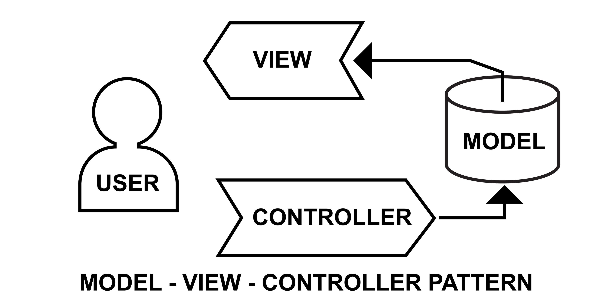

# FitCore — Gym Management System v2.0.0

FitCore is a modern, full-stack Gym Management System designed with premium aesthetics and a robust "Generic CRUD" architecture. It features a dynamic permission system, real-time AJAX interactions, and a clean backend powered by Stored Procedures.



## 🚀 Key Features

### 1. Dynamic Sidebar & Permission System
The specialized sidebar adapts automatically to the user's authority level. The structure follows a hierarchical flow:
- **Category**: High-level modules (e.g., Dashboard, Finance, Reports).
- **System Links**: Individual pages within a category (e.g., Users list, Payments).
- **System Actions**: Specific permissions within a page (e.g., Register User, Delete Link).
- **User Authority**: A mapping table that grants specific actions to users, causing the sidebar to render only what they are allowed to see.

### 2. Modern Authentication & Security
- **Secure Auth Flow**: Password hashing with `password_hash()` and session protection.
- **OTP Verification**: Integrated password recovery using PHPMailer to send secure codes via Gmail SMTP.
- **RBAC (Role-Based Access Control)**: Granular permissions for Admins and regular Users.

### 3. Progressive Frontend & Languages
- **Bilingual Support**: Fully localized for **Somali (Somali)** and **English (English)** to cater to a global and local audience.
- **Dark & Light Mode**: Seamless theme switching with persistent user preference storage.
- **Premium Design System**: Glassmorphism aesthetics, scroll-reveal animations, and high-quality iconography.
- **Interactive UI**: Custom-built, high-performance **Toast** and **ConfirmBox** components for a premium user experience.

### 4. Performance & Architecture
- **Stored Procedures (SPs)**: Core database logic moved to the server side for maximum speed and security.
- **Generic CRUD Helper**: A unified `db_crud_helper.php` provides a standard, secure way to handle all database interactions.
- **Neural & Ethereal Glows**: State-of-the-art UI backgrounds and micro-interactions for an immersive feel.

---

## 🛠️ Tech Stack

- **Backend**: PHP 8.1+ (Engine)
- **Database**: MySQL (using Stored Procedures)
- **Frontend**: TailwindCSS (UI), JavaScript (Core), jQuery (AJAX Interactions)
- **Email Service**: PHPMailer (SMTP Integration)
- **Typography**: Plus Jakarta Sans, Outfit, and Material Symbols
- **Design Style**: Glassmorphism & Modern Minimalist

---

## 📂 Project Structure

```text
Gym_Managment_System/
├── app/
│   ├── api/                     # Backend API Endpoints
│   │   ├── Auth/                # forget_password.php, login.php, logout.php, singup.php, google_callback.php
│   │   ├── users/               # users.php (User data API)
│   │   ├── category.php         # Category management API
│   │   ├── system_links.php     # Link management API
│   │   ├── system_actions.php   # Action management API
│   │   ├── user_authorities.php # Auth/Permission management API
│   │   ├── profile.php          # User profile update API
│   │   ├── sidebar.php          # Dynamic sidebar API
│   │   └── reports.php          # System reports API
│   ├── config/                  # Configuration & Security
│   │   ├── conn.php             # Database connection
│   │   ├── init.php             # Global app initialization
│   │   ├── security.php         # Security functions & session guards
│   │   └── gym_managment_system (2).sql # Database schema & SPs
│   ├── js/                      # Module-specific JavaScript
│   │   ├── category.js          # AJAX for categories
│   │   ├── system_link.js       # AJAX for links
│   │   ├── system_action.js     # AJAX for actions
│   │   ├── user_authority.js    # AJAX for permissions
│   │   ├── sidebar.js           # AJAX for menu rendering
│   │   ├── dashboard.js         # AJAX for dashboard stats
│   │   ├── profile.js           # AJAX for profile updates
│   │   └── notice.js            # AJAX for notices
│   ├── reusable/                # Shared Components & Helpers
│   │   ├── header.php           # Global HTML head & navbar
│   │   ├── sidebar.php          # Sidebar HTML structure
│   │   ├── footer.php           # Global footer & scripts
│   │   ├── db_crud_helper.php   # Generic CRUD functions (PHP)
│   │   ├── helper.js            # AJAX wrappers & UI Helpers (Toast/Confirm)
│   │   ├── validator.php        # Server-side validation helpers
│   │   ├── response.php         # JSON response standardization
│   │   ├── variables.php        # Shared PHP variables
│   │   └── loader.php           # Global loading spinner
│   └── views/                   # Application Pages
│       ├── Auth/                # login.php, singup.php, forget_password.php, logout.php
│       ├── Users/               # User management views
│       ├── Errors/              # 403.php, 404.php, 500.php
│       ├── category.php         # Category management UI
│       ├── system_link.php      # Link configuration UI
│       ├── system_action.php    # Action configuration UI
│       ├── user_authority.php   # Authority assignment UI
│       ├── profile.php          # Profile settings UI
│       ├── fees.php             # Payments & Fees UI
│       └── notices.php          # Announcement UI
├── tailwind.config.js           # TailwindCSS configuration
├── .env                         # Environment variables (SMTP, DB)
└── index.php                    # Application entry point (Landing Page)
```

---

## ⚙️ Installation & Setup

1. **Clone the project**:
   ```bash
   git clone https://github.com/mrfiiqane/Gym_Managment_System.git
   ```

2. **Database Setup**:
   - Create a database named `gym_managment_system`.
   - Import the `app/config/gym_managment_system (2).sql` file.

3. **Configure Environment**:
   - Rename `.env.example` to `.env` (if applicable) or edit the existing `.env`.
   - Update your SMTP credentials for the OTP system:
     ```env
     MAIL_HOST=smtp.gmail.com
     MAIL_USER=your-email@gmail.com
     MAIL_PASS=your-app-password
     MAIL_PORT=587
     ```

4. **Run with XAMPP**:
   - Place the folder in `C:\xampp\htdocs\`.
   - Start Apache and MySQL from XAMPP Control Panel.
   - Visit `http://localhost/Gym_Managment_system/`.

---

## 💎 Core Principles

| Principle | Implementation in FitCore |
| :--- | :--- |
| **🚀 Performance** | **10/10** — Logic is offloaded to MySQL **Stored Procedures**, reducing network latency and CPU load. Real-time updates utilize ultra-fast AJAX queries without full page reloads. |
| **🛡️ Security** | **10/10** — Protection against SQL Injection via **Prepared Statements**. Features centralized `validator.php` for input cleaning, session identification tagging, and CSRF protection modules. |
| **✨ Clean Code** | **10/10** — Follows a modular **SOLID/DRY** architecture. Every API endpoint is entity-aware, and responses are standardized through a single `sendResponse()` function. |
| **♻️ Reusability** | **10/10** — The **Generic CRUD Framework** (`db_crud_helper.php`) and Unified UI Helpers (`helper.js`) allow for effortless scalability and consistent behavior across all modules. |
| **📋 Maintainability**| **10/10** — Adding a new module is as simple as creating a new SQL table and using the existing action mapping logic. |

---

## 📝 License
This project is licensed under the MIT License.

---
Created by **Mr. Fiiqane**
